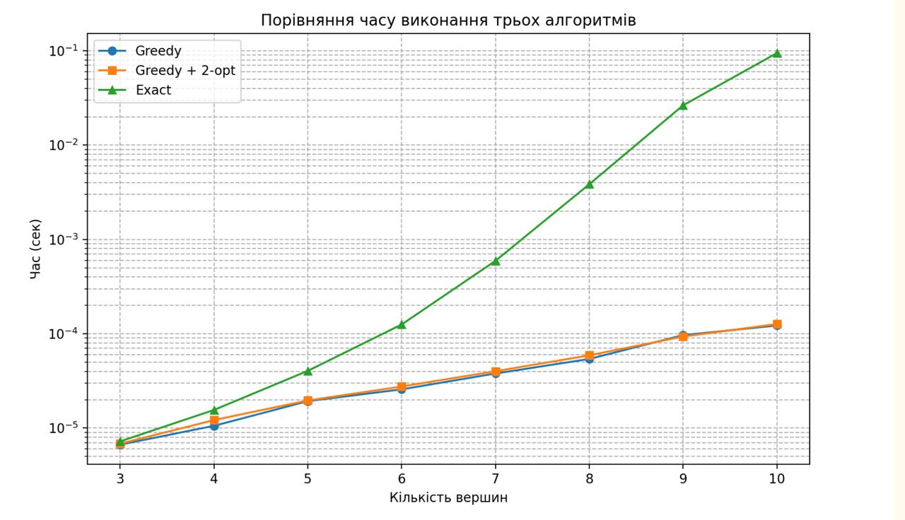
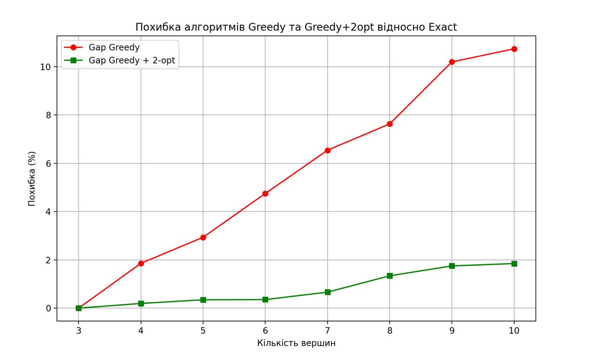

# optimal-delivery
The Vehicle Routing Problem (VRP) is one of the central problems in operations research, logistics, and combinatorial optimization. It generalizes many routing and scheduling problems and is crucial for industries such as transportation, delivery services, and supply chain management.

The task concerns the optimization of logistic operations in a transportation system. A set of delivery vehicles must service a set of customer demands, each associated with a specific location and weight. The underlying transportation network is modeled as an undirected weighted graph. The objective is to construct feasible and efficient routes for all vehicles while minimizing total transportation cost (e.g., distance or fuel consumption).

## Problem Statement
The transportation network is represented as a weighted undirected graph:
- **Nodes**: depots points
- **Edges**: roads with associated distances
- **Vehicles**: each with a capacity constraint

## The problem can be broken down to 3 main parts:
1. Shortest Path Computation in Weighted Graph (Dijkstra's Algorithm used)
2. Packing Trucks (Capacity-Aware + Distance-Aware Bin Packing)
3. Route Optimization for Each Truck (Traveling Salesman Problem, 2-Opt Algorithm used)

## Goal:
Create a delivery algorithm that:
- finds the shortest paths in the graph (determines optimal routes between points)
- distributes cargo between trucks using the greedy principle (assigns cargo to the truck that can perform it most efficiently)
- builds a route for each truck using the approximate TSP approach (arranges delivery points in a rational sequence)
- improves the generated route using the 2-opt method (shortens the path by eliminating unnecessary stops and intersections)

### In the project, the transportation system is modeled as an *undirected weighted graph*, where:
- vertices are points of interest (depots and delivery addresses)
- edges are roads between points (if there is no road - there is no edge)
- edge weight is the length or cost of movement (distance, time, fuel consumption)
- truck route is a path in the graph that starts and ends at the depot.

## What we do?
**1. Finding the shortest paths**
- For each important vertex (depot + delivery point) we run Dijkstra's algorithm.
- We get the shortest distances to all other points.
- We form a matrix of shortest paths, which we use further.

**2. Cargo distribution**
- Sort the cargo (e.g., heaviest first).
- For each cargo, we look at all the trucks.
- Choosing the one that is most profitable to take it:
    - it has enough space;
    - it is closest to the delivery point;<br>
this will reduce the total time/length of the route.
- Adding the cargo to this truck and update:
    - its remaining capacity;
    - its current position on the graph.

**3. Route construction (TSP-nearest-neighbor)**<br>
We use the classic **greedy nearest neighbor approach**:
- Start with the depot.
- Choose the nearest unvisited delivery point.
- Go to it.
- Repeat until all points are visited.
- Go back to the depot.

This gives a fast and simple route that is easy to optimize further.

**4. Route optimization (2-opt)**
- reduce the length of the route;
- remove intersections;
- make the path more logical and smooth;
- significantly improve the greedy solution of the TSP. 

The route remains the same in terms of the set of points,
only the order of their visits changes.

## Algorithms implemented:
### Dijkstra Algorithm
Dijkstra's Algorithm allows us to find the shortest path between two vertices in a graph.
Using Dijkstra’s algorithm, it calculates the shortest distances between every relevant pair of points (the depot and all delivery points). This produces a distance matrix that serves as the foundation for all later routing decisions.

This is an algorithm that:
- finds the shortest paths in a weighted graph
- works only with positive weights
- step by step selects the vertex with the smallest current distance
- gradually "expands" the region of already found optimal paths

This is one of the basic algorithms of graph theory.

**Advantages**
- guarantees minimum distance;
- fits perfectly into our logistics model;
- is fast and stable for our scale of the task.

**Complexity**:<br>
        **Time**: O(V^2), where V is the number of vertices.<br>
        **Space**: O(V) for storing distances and predecessors.

### 2-Opt Algoritm
The 2-Opt algorithm is a local search heuristic used to improve an existing tour in the Traveling Salesman Problem (TSP) and related routing problems.
It operates by repeatedly replacing two edges in the tour with two different edges obtained by reversing the order of the nodes in the intermediate segment.
A 2-Opt move is performed only if it results in a shorter tour length.
The process continues until no improving 2-Opt moves remain, at which point the tour is said to be 2-optimal.

**Advantages**
- Simple and intuitive: Easy to implement and understand.
- Effectively removes edge crossings
- Produces large improvements: typically yields 20–40% better solutions compared to a random or greedy initial tour.
- Deterministic improvement: Each accepted move strictly reduces the total tour length.
- Good scalability: Performs well for problems with thousands of nodes.
- Widely used: Forms the basis for more advanced heuristics 

**Complexity**:<br>
        **Time**: O(n^2 ⋅ k), where k is the number of improving iterations<br>
        **Space**: O(n) for storing distances and predecessors.

### Exact Algorithm
Exact algorithms for the Traveling Salesman Problem (TSP) guarantee finding the optimal tour by exhaustively exploring the solution space or by using systematic methods such as dynamic programming or branch-and-bound.
These methods ensure that the returned solution is provably minimal in total length.
Although exact algorithms provide perfect accuracy, they are computationally expensive and typically applicable only to small or medium-sized instances.

**Advantages**
- Guarantees optimality: Always returns the best possible tour.
- Mathematically rigorous: Provides provable optimality bounds and certificates.
- No randomness: Results are fully deterministic.
- Useful for benchmarking: Serves as a reference for evaluating heuristics and approximation algorithms.
- Solves small/medium cases perfectly: Practical for instances up to 20–40 nodes (dynamic programming) or even 80–100+ nodes (branch-and-bound with good pruning).
  
**Complexity:** <br>
    **Time**: O(n² · 2ⁿ)
    **Space**: O(n · 2ⁿ)
    
### Greedy Algorithm
Greedy algorithms for the Traveling Salesman Problem (TSP) build a tour step by step, choosing the best local option at each stage—typically the nearest unvisited vertex.
The most common version is the Nearest Neighbor (NN) heuristic.
Although greedy methods do not guarantee finding the optimal tour, they are extremely fast and easy to implement.
The choice of the starting vertex can significantly influence the quality of the resulting tour, so the algorithm is sometimes run from multiple starting points.

**Advantages**
- Very fast execution: runs in linear or near-linear time.
- Simple implementation: easy to code and understand.
- Provides a quick baseline tour: useful as an initial solution for local search methods (2-Opt, 3-Opt).
- Scales to large instances: can handle thousands or even tens of thousands of nodes.
- Deterministic (if the starting vertex is fixed): always returns the same solution.

**Complexity:**
     **Time**: O(n²) 
     **Space**: O(n) — only the list of visited vertices needs to be stored.
     
## Statistics




## Run program

### cli arguments
| Argument     | Description                      |
| ------------ | -------------------------------- |
| `--graph`    | Path to graph JSON file          |
| `--trucks`   | Path to trucks JSON file         |
| `--packages` | Path to packages JSON file       |
| `--depot`    | Depot node ID (default 0)        |
| `--no-gui`   | Disable plotting of truck routes |

### examples

#### run with gui
```bash
python3 main.py \
  --graph examples/example\ 1/graph.json \
  --trucks examples/example\ 1/trucks.json \
  --packages examples/example\ 1/packages.json \
  --depot 0
```

#### run without gui
```bash
python3 main.py \
  --graph examples/example\ 1/graph.json \
  --trucks examples/example\ 1/trucks.json \
  --packages examples/example\ 1/packages.json \
  --depot 0 \
  --no-gui
```

#### examples of json files

#### graph.json
```json
[
  [0, 3, 0, 0, 7],
  [3, 0, 2, 0, 0],
  [0, 2, 0, 1, 8],
  [0, 0, 1, 0, 4],
  [7, 0, 8, 4, 0]
]
```

#### packages.json
```json
[
  {"id": 201, "weight": 5, "dest": 2},
  {"id": 202, "weight": 4, "dest": 3},
  {"id": 203, "weight": 3, "dest": 4},
  {"id": 204, "weight": 2, "dest": 1}
]
```

#### trucks.json
```json
[
  {"id": 1, "capacity": 10},
  {"id": 2, "capacity": 12}
]
```

More examples can be found in examples/

## Function structure
### dijkstra
- implementation of Dijkstra's algorithm
- the get_path() function for route recovery
- is used when constructing the shortest path matrix

### route_construction
- building a route for a truck (nearest neighbor)
- optimizing the route (2-opt)
- calculating the cost of the route
- forms the final path of the truck

### algorithm
- greedy distribution of cargo between trucks
- logic of capacity, distances, selection of the best truck
- returns the structure: which cargo → to which truck

### main
- processing CLI commands
- loading data (test1.json, trucks.json)
- calling all stages of the algorithm:

**Dijkstra → Assignment → Route → Optimization → Visualization**

#### Module interaction logic

**Graph**<br>
↳
**dijkstra** → shortest path matrix<br>
↳
**algorithm** → load distribution<br>
↳
**route_construction** → route construction and optimization<br>
↳
**main** → launch, merge all stages, visualization<br>

## Team
**[Markhevka Oleksandr](https://github.com/OrGreeM)**<br>
↳ Dijkstra Algorithm. <br>
↳ Calculating the shortest distances between relevant vertices (depot and all delivery points) and corresponding paths between relevant vertices.<br>

**[Ryshko Danylo](https://github.com/postcoitt)**<br>
↳ Assignment: alternately assigning each load to the truck where it is logical to "add", according to a greedy criterion.<br>
↳ 2-Opt Algorithm

**[Kremer Sofiia](https://github.com/kremeriatko8)**<br>
↳ Route construction for each truck: given a set of points for the car, constructing the route (TSP subtask) greedily.<br>
↳ Exact Algorithm

**[Zavada Sofiia](https://github.com/Zavada-Sofiia)**<br>
↳ Working with graphs, .dot, visualization.<br>
↳ Command Line Interface.<br>
↳ README <br>

**[Shymanska Natalia](https://github.com/natalish28)**<br>
↳ Tester - all doctests, functionality for comparing exact and greedy algorithms, keeping statistics on this.<br>

**[Kopiy Viktoria](https://github.com/gardenviki-prog)**<br>
↳ Documentation, presentation.<br>

## Impressions from the project implementation
Working on this project provided valuable experience in designing, decomposing, and implementing a complete optimization pipeline for a real-world logistics task. Each stage required not only understanding the theoretical background of the algorithms (Dijkstra, assignment heuristics, TSP, 2-Opt), but also adapting them to work together efficiently within a unified system.

The VRP turned out to be significantly more complex than its individual components. Even simple steps — such as choosing which truck should take the next load or determining the order of deliveries — required careful balancing between accuracy and performance. Through this project, we gained practical insights into how greedy heuristics behave on real data, and how local search methods (like 2-Opt) can drastically improve initially suboptimal routes.
Teamwork played a key role: the project required clear communication between modules, consistent data structures, and a shared understanding of the system’s logic. This helped integrate contributions from multiple people into a coherent, stable solution.

Overall, the project strengthened our skills in algorithmic thinking, optimization techniques, modular program design, and collaborative development. It demonstrated how theoretical algorithms become practical tools when applied to real logistics scenarios.

## Feedback to the Instructors
Thank you for organizing and supervising this project. The task was clear, well-structured, and allowed us to apply theoretical algorithms to a practical logistics problem. Your guidance and explanations helped us stay focused and work effectively as a team. This project gave us valuable experience with optimization methods and collaborative development.
